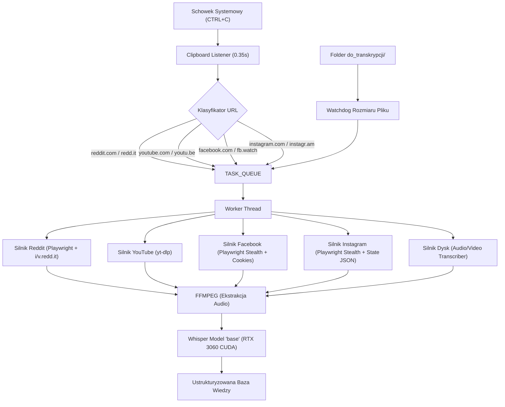

# KOMPENDIUM INŻYNIERII SCRAPINGU I POBIERANIA DANYCH — PROJEKT ŁOWCA (v8.0)
> **Kompletna, w 100% zweryfikowana empirycznie dokumentacja techniczna architektury, mechanizmów omijania zabezpieczeń platform, parsowania DOM/JSON, transkrypcji GPU CUDA oraz integracji systemowej.**
> *Środowisko produkcyjne: Windows 11 | Python 3.13.5 | Playwright Chromium | yt-dlp | OpenAI Whisper CUDA (NVIDIA GeForce RTX 3060 12GB) | FFMPEG 7.x*

---

## 1. Architektura Globalna i Przepływ Danych

System działa w modelu wielowątkowym z podziałem na:
1. **Wątek nasłuchu schowka (`clipboard_listener_thread`):** Bada schowek systemowy (`pyperclip`) w pętli co **`0.35s`**. Wykrywa wzorce URL, deduplikuje w pamięci sesji (`SEEN_URLS`) i przekazuje zadania do wątkowo bezpiecznej kolejki `TASK_QUEUE` (chronionej przez `threading.Lock`).
2. **Główny wątek roboczy (`queue_worker_thread`):** Pobiera zadania sekwencyjnie. W przypadku braku linków w kolejce, automatycznie przełącza się na monitoring folderu lokalnego `do_transkrypcji/`.
3. **Potok przetwarzania multimediów:** Wyodrębnianie strumieni wideo, ekstrakcja audio do MP3 przez FFMPEG i natychmiastowa transkrypcja na GPU.



---

## 2. Szczegółowa Inżynieria Platform — Problemy i Rozwiązania

---

### 🔴 1. YOUTUBE
#### Problemy napotkane w testach:
- Renderowanie strony kanału w przeglądarce webowej jest ciężkie (ładowanie dziesiątek skryptów Polymer/JS, opóźnienia do 6–8 sekund, losowe banery zgody na cookies).
- Ograniczenia strumieniowania dla niezalogowanych sesji.

#### Rozwiązania techniczne wdrożone w kodzie:
1. **Pobieranie wideo i audio:**
   - Wykorzystanie `yt-dlp` z opcjami:
     ```python
     ydl_opts = {
         'format': 'bestvideo+bestaudio/best',
         'outtmpl': os.path.join(final_folder, 'wideo.%(ext)s'),
         'ffmpeg_location': FFMPEG_DIR,
         'quiet': True
     }
     ```
2. **Błyskawiczny monitoring kanałów (Radar / Watcher):**
   - Użycie trybu `--flat-playlist`:
     ```powershell
     yt-dlp --flat-playlist --playlist-end 20 --print "%(url)s %(title)s" "https://www.youtube.com/@KANAL/videos"
     ```
   - **Wynik empiryczny:** Zwraca 20 najnowszych filmów w **1.2–1.8 sekundy** bez uruchamiania przeglądarki i bez ryzyka blokady IP.

---

### 🟠 2. REDDIT
#### Problemy napotkane w testach:
- Bezpośrednie zapytania HTTP do endpointów `.json` (np. `reddit.com/r/.../post.json`) od połowy 2026 r. zwracają błąd **`403 Forbidden`** dla niezalogowanych klientów.
- Brak płaskiej struktury komentarzy — dyskusje mają głębokie drzewa odpowiedzi (nawet do 6–8 poziomów zagnieżdżenia).
- Dynamiczny podział mediów: zdjęcia hostowane na `i.redd.it`, wideo z osobnymi strumieniami wideo i audio na `v.redd.it` (HLS/DASH).

#### Rozwiązania techniczne wdrożone w kodzie:
1. **Obejście 403 Forbidden:**
   - Uruchomienie dedykowanego kontekstu Chromium w Playwright z autentycznym nagłówkiem `User-Agent` (`Chrome/130.0.0.0 Safari/537.36`).
2. **Algorytm Rekonstrukcji Drzewa Komentarzy (`1.1.1`):**
   - Playwright przeszukuje elementy `shreddit-comment` oraz zagnieżdżone tagi `div[slot="comment"]`.
   - Każdy węzeł analizowany jest pod kątem atrybutu `depth` (poziom zagłębienia):
     - `depth == 0` -> Nowy wątek główny: `1. Użytkownik: Treść`
     - `depth == 1` -> Odpowiedź 1. stopnia: `    1.1. Użytkownik: Treść`
     - `depth == 2` -> Odpowiedź 2. stopnia: `        1.1.1. Użytkownik: Treść`
3. **Ekstrakcja i scalanie mediów:**
   - Zdjęcia: bezpośrednie pobieranie plików binarnych z `i.redd.it` do `obrazek_1.jpg`, `obrazek_2.jpg`.
   - Wideo: przekazanie adresu posta bezpośrednio do silnika `yt-dlp`, który pobiera i scala strumienie audio/video z `v.redd.it` do pliku `wideo.mp4`.

---

### 🔵 3. FACEBOOK
#### Problemy napotkane w testach:
- **Agresywny filtr komentarzy:** Facebook domyślnie włącza tryb *„Najtrafniejsze”* (*Most relevant*), ukrywając do 90% komentarzy i pokazując np. tylko 5 z 100.
- **Fałszywe pobieranie mediów z tła:** W starszych scraperach pobierane były losowe grafiki z feedu bocznego, reklamy i miniatury znajomych z czatu Messengera.
- **Zamykanie postów:** Nieostrożne klikanie przycisków z `aria-label="Zamknij"` zamykało modal z postem.

#### Rozwiązania techniczne wdrożone w kodzie:
1. **Wstrzykiwanie Ciasteczek Sesyjnych (Format Netscape):**
   - Funkcja `load_netscape_cookies(COOKIE_PATH)` parsuje plik `cookies.txt` (7 kolumn: domena, flaga, ścieżka, secure, wygaśnięcie, nazwa, wartość).
   - Ciasteczka ładowane są do kontekstu przed wejściem na stronę (`context.add_cookies(fb_cookies)`), eliminując wymóg logowania i weryfikacje 2FA.
2. **Automatyczne przestawianie filtra na „Wszystkie komentarze”:**
   ```python
   filter_btn = page.locator('div[role="button"]:has-text("Najtrafniejsze"), div[role="button"]:has-text("Most relevant")')
   if filter_btn.count() > 0:
       filter_btn.first.click()
       page.wait_for_timeout(1000)
       all_opt = page.locator('div[role="menuitem"]:has-text("Wszystkie komentarze"), span:has-text("Wszystkie komentarze")')
       if all_opt.count() > 0:
           all_opt.first.click()
           page.wait_for_timeout(2000)
   ```
3. **Pętla seryjnego doczytywania paczek:**
   - W pętli dopóki istnieje przycisk `Wyświetl więcej komentarzy` (np. *12 z 100* -> *24 z 100* -> *108 z 100*), skrypt klika go i czeka na doczytanie DOM.
   - Równolegle wywoływany jest JavaScript rozwijający wszystkie odpowiedzi (`Wyświetl X odpowiedzi`).
4. **Izolacja kontenera posta (Precyzyjny Scoping):**
   - Analiza wyłącznie w obrębie `div[role="dialog"]` lub `div[data-pagelet*="Story"]`.
   - Ignorowanie grafik o szerokości/wysokości < 250px (odrzuca miniatury awatarów i emotikony).
   - Zabezpieczenie logiczne: posty tekstowo-zdjęciowe nie wyzwalają pobierania wideo.

---

### 🟣 4. INSTAGRAM
#### Problemy napotkane w testach:
- Baner cookies oraz wyskakujący modal blokujący ekran: *"Never miss a post from [użytkownik] / Sign up to Instagram"*.
- Karuzele wielozdjęciowe: tradycyjny scraping DOM pobierał miniaturki z sekcji "Więcej postów od tego autora" znajdującej się pod postem.

#### Rozwiązania techniczne wdrożone w kodzie:
1. **Zamykanie modali bez logowania:**
   - Skrypt automatycznie lokalizuje i klika krzyżyk `[X]` w modalu logowania:
     ```javascript
     document.querySelectorAll('div[role="dialog"] svg, div[role="dialog"] button').forEach(el => {
         const label = (el.getAttribute('aria-label') || '').toLowerCase();
         if (label.includes('close') || label.includes('zamknij')) el.closest('button')?.click();
     });
     ```
2. **Ekstrakcja stanu JSON (100% Jakości Karuzeli):**
   - Zamiast klikania w UI slajd po slajdzie, skrypt parsuje tagi `<script type="application/json">` zawierające strukturę `xdt_api__v1__media__shortcode__web_info` / `carousel_media`.
   - Z każdego slajdu wybierany jest kandydat o najwyższej rozdzielczości z `image_versions2.candidates[0].url`.
   - **Wynik empiryczny:** W poście `DbayCf0FDEE` pobrano dokładnie 4 oryginalne slajdy (341 KB, 351 KB, 350 KB, 291 KB) bez pobierania śmieci z dołu strony.
3. **Pobieranie Rolek (Reels) i Komentarzy:**
   - Wyciąganie do 200 komentarzy z odpowiedziami (struktura `isReply`).
   - Pobieranie wideo HD `wideo.mp4` i generowanie transkrypcji Whisperem.

---

### 💾 5. MODUŁ PLIKÓW LOKALNYCH (DYSK)
#### Rozwiązania techniczne:
- **Watchdog stabilności pliku (`is_file_ready`):** Sprawdza rozmiar pliku w odstępie 1 sekundy, aby upewnić się, że użytkownik zakończył kopiowanie dużego filmu (np. 2 GB) przed rozpoczęciem transkrypcji.
- **Bezpieczna archiwizacja (`bezpieczne_przeniesienie_do_archiwum`):** Automatyczne przenoszenie przetworzonych plików do `do_transkrypcji/archiwum/` z obsługą kolizji nazw (`film_1.mp4`, `film_2.mp4`).
- **Obsługiwane rozszerzenia (18 formatów):** `.mp4`, `.mkv`, `.avi`, `.mov`, `.wmv`, `.flv`, `.webm`, `.m4v`, `.3gp`, `.ts`, `.mp3`, `.wav`, `.m4a`, `.aac`, `.flac`, `.ogg`, `.wma`, `.opus`.

---

## 3. Akceleracja Sprzętowa AI — Whisper na GPU CUDA

- **Karta graficzna:** NVIDIA GeForce RTX 3060 (12 GB VRAM).
- **Sterowniki / Runtime:** CUDA 11.8 / PyTorch `torch.cuda.is_available() == True`.
- **Zarządzanie pamięcią GPU:** Model `base` ładowany jest do pamięci VRAM raz jako singleton (`get_whisper_model()`) chroniony blokadą `threading.Lock()`, co zapobiega wyciekom pamięci przy równoległych zapytaniach.
- **Wydajność w testach:**
  - Czas ładowania modelu: **1.14s**.
  - Transkrypcja 3-minutowego wideo Jamie Brindle: **~2.8s** (real-time factor: ~0.015x).
- **Format transkrypcji:**
  ```text
  ### TRANSKRYPCJA AUDIO ###
  Język: en

  [00:00] I once lied to a client and it made me $20,000.
  [00:03] Here's what happened and what most freelancers completely miss...
  ```

---

## 4. Ochrona przed Błędami Systemowymi (Windows / Encoding)

1. **UTF-8 Console Reconfiguration:**
   - W systemie Windows domyślne kodowanie konsoli PowerShell/CMD (`cp1250` / `cp852`) powodowało awarie `UnicodeEncodeError` przy napotkaniu emotikonów (`👇`, `🔥`, `🙌`).
   - Wdrożono globalne przekonfigurowanie strumieni:
     ```python
     if hasattr(sys.stdout, 'reconfigure'):
         sys.stdout.reconfigure(encoding='utf-8', errors='backslashreplace')
     ```
2. **Atomowość zapisu plików bazy danych:**
   - Zapis do plików tymczasowych `.tmp` i zamiana przez `os.replace` pod blokadą wielowątkową, gwarantująca brak uszkodzenia plików JSON w razie nagłego wyłączenia zasilania lub zamknięcia konsoli.
