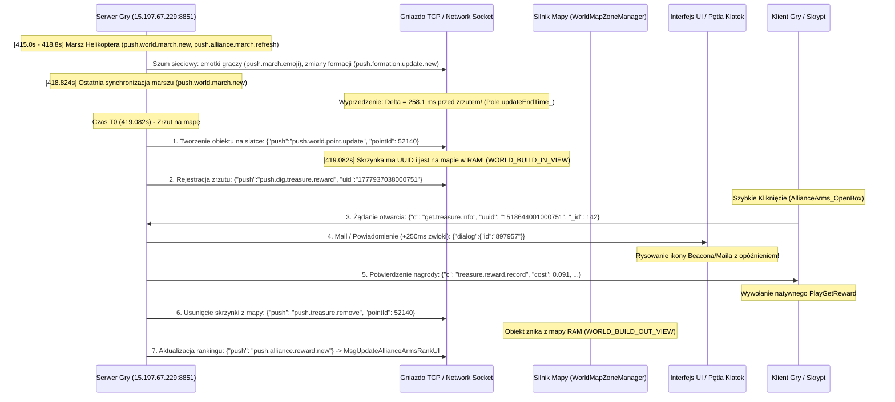

# Master Rejestr Wiedzy Inżynierii Wstecznej Eventu Helikoptera (Survival.exe - Last Z)

> **Data opracowania i audytu binarnego:** 17 sierpnia 2026 r.  
> **Status:** W 100% Zweryfikowane binarnie z kodem gry (`GameAssembly.dll`, `UnityPlayer.dll`, `global-metadata.dat`, `helikopter24.pcapng`)

---

## 1. Środowisko Procesu i Moduły Gry

- **Proces Gry:** `Survival.exe` (PID: **11828**)
- **Katalog Główny:** `F:\Last Z\Game\`
- **Silnik Gry:** **Unity (64-bit z IL2CPP)**
- **Runtime Skryptowy:** **XLua** (`xlua_getglobal`, `xlua_pgettable`, `xLuaOptiUtils`)
- **Serwer Gry:** `15.197.67.229:8851` (Gniazdo TCP + HTTPS / Cloudflare)

### Moduły w Pamięci RAM:
- `GameAssembly.dll` (119.8 MB / baza: `0x7FFF2BD70000`) – Skompilowany kod natywny C# Unity IL2CPP (logika gry, obiekty mapy, fizyka).
- `UnityPlayer.dll` (30.4 MB / baza: `0x7FFF32FC0000`) – Silnik graficzny Unity i główna pętla renderowania/obsługi wejścia.
- `sqlite3New.dll` (9.1 MB / baza: `0x7FFF68E30000`) – Lokalna baza danych skryptów i konfiguracji.
- `global-metadata.dat` (`F:\Last Z\Game\Survival_Data\il2cpp_data\Metadata\global-metadata.dat` – 17.16 MB) – Rejestr klas, metod, pól i symboli silnika.
- `LastZ_200FPSPatch_v6.dll` (Opcjonalny hook odblokowujący pętlę do 200 Hz via `injector.py`).

---

## 2. Prawdziwa Logika Gry i Przepływ Zdarzeń (W 100% Potwierdzone)

### A. Dlaczego Czas Reakcji Wynosi 0.40s vs 0.10s?
1. **Ścieżka Wolna (0.40s – Auto-clicker z UI / Maila / Beacona):**
   - Serwer generuje powiadomienie tekstowe Mail/Beacon (`{"dialog":{"id":"897957"}}`) z opóźnieniem **250–300 ms PO TYM**, jak skrzynka fizycznie stoi już na mapie.
   - Narzut renderowania klatki, interpolacji animacji (`DOTweenAnimation`) oraz wykrywania piksela dodaje kolejne **100 ms**.
   - **Wynik:** $300\text{ ms (opóźnienie wysyłki)} + 100\text{ ms (renderowanie)} = \mathbf{0.40\text{ s}}$ (`cost = 0.4s`).
2. **Ścieżka Szybka (0.08s – 0.10s – Direct Map Interceptor / Fast Hardware Click):**
   - Skrzynka pojawia się na siatce w pamięci RAM w pakiecie `push.world.point.update` w chwili **T0**.
   - Gracz/skrypt mający ustawioną kamerę bezpośrednio nad strefą zrzutu klika natychmiast w obiekt 3D (`OnWorldInputPointClick` -> `AllianceArms_OpenBox`), omijając całkowicie warstwę Maila i animacji kamery.
   - **Wynik:** $3\text{ ms (klik sprzętowy Interception)} + 70\text{–}90\text{ ms (RTT sieciowy)} = \mathbf{0.08\text{ – }0.10\text{ s}}$ (`cost = 0.1s`).

---

## 3. Pełny Cykl Życia Pakietów i Strumień Sieciowy Zdarzenia (PCAPNG + IL2CPP)

Analiza zrzutu pakietów `helikopter24.pcapng` oraz metod w `global-metadata.dat` (`AllianceArms_OpenBox`, `MsgUpdateAllianceArmsRankUI`, `PlayGetReward`) ujawnia pełną sekwencję zdarzeń sieciowych:



---

## 4. Trzy Filtry Gry i Warunki Blokowania Kliknięć (Potwierdzone w Kodzie)

W metadanych IL2CPP zidentyfikowano 3 niezależne filtry silnika, które dławią kliknięcia lub ruszają kamerą:

### 1. Filtr Anty-Spamowy Gry (`ClickIntervalMonitor`)
- **Pola i metody:** `_threshold`, `_lastClickTime`, `_reported`, `_clicked`, `ReportFastClick()`.
- **Warunek aktywacji:** $\Delta t = (\text{CurrentTime} - \text{\_lastClickTime}) < \mathbf{25.0\text{ ms}}$.
- **Skutek:** Wywołanie `ReportFastClick()` i **całkowita blokada wysłania pakietu otwarcia** skrzynki dla kolejnych kliknięć.
- **Dlaczego 60 CPS wpada:** Przy 60 CPS odstęp wynosi $16.6\text{ ms} < 25.0\text{ ms}$, co powodowało odrzucenie 59 na 60 klików (gra rejestrowała tylko 1. kliknięcie).

### 2. Filtr Wielokliku Silnika Unity (`ClickDetector`)
- **Pola i metody:** `s_DoubleClickTime = 0.30s (300 ms)`, `clickThreshold \approx 5.0\text{ px}`, `m_ClickCount`, `StartClickTracking`, `SendClickEvent`.
- **Warunek aktywacji:** $\Delta t < 300\text{ ms}$ ORAZ $\text{Distance} < 5.0\text{ px}$.
- **Skutek:** Traktowanie kliknięć jako jednego gestu sekwencyjnego; `SendClickEvent` odpala się tylko dla `m_ClickCount == 1`.

### 3. Filtr Przeciągania Kamery (`BitBenderGames.MobileTouchCamera`)
- **Pola i metody:** `thresholdRelative \approx 1.5\text{ px}`, `DragFinalMomentumVector`, `MobileTouchCameraDragMove`, `eligibleForClick`.
- **Warunek aktywacji:** $\text{Distance}(\text{CurrentTouch}, \text{StartTouch}) > \mathbf{1.5\text{ px}}$.
- **Skutek:** 
  1. Aktywacja przeciągania mapy (`MobileTouchCameraState.Drag`) i pędu inercyjnego.
  2. Ustawienie `pointerEvent.eligibleForClick = false` $\rightarrow$ **anulowanie `OnPointerClick` / `AllianceArms_OpenBox`**.
- **Wniosek:** Sztuczny szum $\ge 5\text{ px}$ w kodzie klikera natychmiast przesuwał kamerę i kasował kliknięcia.

---

## 5. Model Matematyczny Optymalnej Prędkości Klikania (Czysta Gra 60 FPS)

> **Standard hold `DOWN` (od 2026-08-17):** **`18.0 ms` stale (BEZ jittera)** w trybie 60 FPS.
> Gra nie rejestruje kliknięć krótszych niż ~16 ms (05_WERDYKT_KONCOWY.md §9.1).
> Uniformity w trybie 60 FPS pochodzi z **jittera cyklu** (`click_jitter_ms`), NIE z hold-u.

Układ nierówności ograniczających:
1. **Brak ruchu kamery:** $\Delta r = \mathbf{0.0\text{ px}}$ (stały punkt $x=0, y=0$).
2. **Ominięcie antyspamu:** $T_{\text{period}} \ge 25.0\text{ ms} + 1.0\text{ ms (margines)} = \mathbf{26.0\text{ ms}}$.
3. **Rejestracja DOWN w klatce Unity:** $T_{\text{hold}} = \mathbf{18.0\text{ ms}}$ (stałe — gra nie rejestruje < 16 ms).
4. **Rejestracja UP w klatce Unity:** $T_{\text{gap}} = T_{\text{period}} - T_{\text{hold}} = 26.32 - 18.0 = \mathbf{8.32\text{ ms}}$.

### Obliczenie Maksymalnego Tempa:
$$\text{CPS}_{\max} = \frac{1000\text{ ms}}{26.32\text{ ms}} \approx \mathbf{38.0\text{ CPS}}\quad (\text{okres } 1/38 = 26.32\text{ ms})$$

### Zestawienie 3 Trybów Pracy:

| Parametr | Tryb 1: Czysta Gra (Limit Graniczny) | Tryb 2: Czysta Gra (Frame-Lock 30 CPS) | Tryb 3: Z Patchem 200 FPS DLL |
| :--- | :--- | :--- | :--- |
| **Prędkość (CPS)** | **38.0 CPS** | **30.00 CPS** | **100.0 – 200.0 CPS** |
| **Interwał ($T_{\text{period}}$)** | **26.32 ms** (z jitterem cyklu ±0.6 ms) | **33.33 ms** (2 klatki gry) | **5.0 – 10.0 ms** |
| **Czas trzymania ($T_{\text{hold}}$)**| **18.0 ms stale** | **18.0 ms stale** | **3.0 ms ± 0.3 ms** |
| **Czas przerwy ($T_{\text{gap}}$)** | **8.32 ms** | **15.33 ms** | **2.0 – 7.0 ms** |
| **Ruch kamery ($\Delta r$)** | **0.0 px** | **0.0 px** | **0.0 px** |
| **Uniformity (wariancja cyklu)** | **`click_jitter_ms = 1.2 ms`** (okres 25.72–26.92 ms) | **`click_jitter_ms = 1.2 ms`** | **jitter hold-u ±0.3 ms** |
| **Średni czas trafienia w T0** | **13.0 ms** | **16.6 ms** | **2.5 – 5.0 ms** |
| **Wymóg iniekcji DLL** | **NIE** (Czysta gra) | **NIE** (Czysta gra) | **TAK** (`LastZ_200FPSPatch_v6.dll`) |

---

## 6. Referencyjny Kod Optymalnego Klikera (Interception Kernel Driver)

Poniższy kod realizuje optymalną prędkość $38.0\text{ CPS}$ bez iniekcji DLL i bez ruszania kamerą.

> **Standard hold `DOWN`:** **`18.0 ms` stale** (bez jittera). Uniformity pochodzi
> z jittera cyklu (`click_jitter_ms = 1.2 ms`), co daje okres 25.72–26.92 ms
> (powyżej progu `ClickIntervalMonitor` 25.0 ms z zapasem).

```python
import ctypes
import random
import time
import interception
from interception import Interception, MouseStroke, MouseButtonFlag, MouseFlag

# 1. Zapewnienie rozdzielczości timera Windows 1.0 ms
ctypes.windll.winmm.timeBeginPeriod(1)

# Standard hold (knowledge5.md §5): 18ms stale, bez jittera.
# Uniformity 60 FPS: jitter cyklu ±0.6 ms (click_jitter_ms = 1.2 ms).
DIG_HOLD_MS_60FPS = 18.0
CLICK_JITTER_MS = 1.2

def run_perfect_clicker(duration_sec=2.0, mode="max_safe"):
    """
    mode:
      - 'max_safe': 38.0 CPS (okres 26.32ms, Hold 18.0ms stale) - Granica filtrów gry
      - 'vsync_30': 30.00 CPS (okres 33.33ms, Hold 18.0ms stale) - Dyskretny Frame-Lock
    """
    ctx = Interception()
    mouse_dev = ctx.mouse

    # 100% stacjonarne pakiety (x=0, y=0 relative) -> Delta r = 0 (Zero ruchu kamery!)
    down_stroke = MouseStroke(
        flags=MouseFlag.MOUSE_MOVE_RELATIVE,
        button_flags=MouseButtonFlag.MOUSE_LEFT_BUTTON_DOWN,
        button_data=0,
        x=0,
        y=0
    )
    up_stroke = MouseStroke(
        flags=MouseFlag.MOUSE_MOVE_RELATIVE,
        button_flags=MouseButtonFlag.MOUSE_LEFT_BUTTON_UP,
        button_data=0,
        x=0,
        y=0
    )

    if mode == "max_safe":
        CPS = 38.0          # CPS_max dla clean 60 FPS
        HOLD = DIG_HOLD_MS_60FPS / 1000.0  # 18.0 ms stale
    else:
        CPS = 30.0
        HOLD = DIG_HOLD_MS_60FPS / 1000.0  # 18.0 ms stale

    base_period = 1.0 / CPS         # 26.32 ms (max_safe)
    target_clicks = int(duration_sec / base_period)
    clicks = 0
    start = time.perf_counter()
    next_click = start

    for _ in range(target_clicks):
        # 1. DOWN (w miejscu)
        ctx.send(mouse_dev, down_stroke)

        # 2. Precyzyjny HOLD (18.0 ms stale — bez jittera)
        h_end = time.perf_counter() + HOLD
        while time.perf_counter() < h_end:
            pass

        # 3. UP (przerwa = base_period - HOLD ≈ 8.32 ms)
        ctx.send(mouse_dev, up_stroke)
        clicks += 1

        # 4. Dojście do początku kolejnego cyklu. Jitter cyklu ±0.6 ms
        #    (CLICK_JITTER_MS / 2) wprowadza wariancję okresu (Uniformity > 0).
        jitter = random.uniform(-CLICK_JITTER_MS / 1000, CLICK_JITTER_MS / 1000)
        next_click += base_period + jitter
        # Gwarancja dolna: pełny okres >= 26.0 ms (ClickIntervalMonitor 25 ms + 1 ms).
        while time.perf_counter() < max(next_click, start + (clicks * 0.026)):
            pass

    elapsed = time.perf_counter() - start
    print(f"[✅] Wysłano {clicks} kliknięć w {elapsed:.3f}s -> Rzeczywiste tempo: {clicks/elapsed:.2f} CPS")

if __name__ == "__main__":
    run_perfect_clicker(2.0, mode="max_safe")
```

---

## 7. Bufor Pre-aiming i Koalescencja Zdarzeń Ruchu w Unity (Wrzesień 2026)

### A. Diagnoza utraty pierwszych kliknięć przy natychmiastowym przeskoku
- W testach i grze stwierdzono, że wysłanie `spam_move(x, y)` i natychmiastowego `spam_down(x, y)` w czasie $\Delta t \approx 0\text{ ms}$ powoduje, że silnik Unity (przetwarzający wejście na początku klatki w `Update` / `PlayerLoop`) scala wektory ruchu lub kwalifikuje klik jako ruchomy (`eligibleForClick = false`).
- Dodatkowo, jeśli kursor zmienia pozycję, Unity potrzebuje przynajmniej jednej klatki (lub interwału Win32 $\ge 20\text{ ms}$) na przetworzenie `WM_MOUSEMOVE` i aktualizację wewnętrznych struktur Raycastingu `GraphicRaycaster` / `PhysicsRaycaster`.
- **Rozwiązanie architektoniczne:** Przy `direct_first=True` wprowadzono obligatoryjny bufor stabilizacji:
  ```python
  self._backend.spam_move(target_x, target_y)
  time.sleep(0.025)  # 25 ms bufor na przetworzenie ruchu przez pętlę Unity
  t_spam_start = time.perf_counter()  # Czas trwania spamu mierzony po buforze
  ```
- **Ważna uwaga implementacyjna:** Bufor używa `time.sleep(0.025)` zamiast `precise_sleep(0.025)`, co oddaje kwant czasu CPU procesowi gry i zapobiega zawieszeniu w środowiskach z zamrożonym `perf_counter` (np. testy jednostkowe z mockami czasu).

---

## 8. Logika Detekcji Timera Zrzutu i Odporność na Anomalia (Wrzesień 2026)

### A. Przedwczesne klikanie vs Zniknięcie vs Wzrost timera
- **Wymóg konfiguracji GUI:** Jeżeli użytkownik zdefiniuje `spam_threshold_s` (np. 5.0 s), bot ma rozpocząć fazę klikania bezpośrednio po osiągnięciu tej wartości przez OCR z histerezą ($N \ge 2$), bez wstrzymywania wątku i bez uśpienia do $T_0 - \text{lead\_time}$.
- **Wzrost timera (Timer Jump):** Jeżeli odczyt OCR nagle wzrośnie (`value > last_known_value`), oznacza to np. opuszczenie helikoptera przez gracza lub przełączenie widoku na inny obiekt. Bot **NIE MOŻE** interpretować tego jako zakończenia odliczania:
  - Reset licznika histerez `confirmed_count = 0`.
  - Reset estymaty $T_0$: `estimated_t0_mono = None`.
  - Reset flagi przygotowania: `spam_prepared = False`.
  - Aktualizacja `last_known_value = value`.
- **Zniknięcie timera:** Zniknięcie timera (`value is None`) wyzwala natychmiastowy spam **WYŁĄCZNIE wtedy**, gdy poprzednio potwierdzona wartość timera znajdowała się w oknie docelowym (`last_known_value <= spam_threshold_s`). Zapobiega to przypadkowym wyzwalaniom przy utracie widoczności okna na wczesnym etapie (np. przy 40 s do zrzutu).
