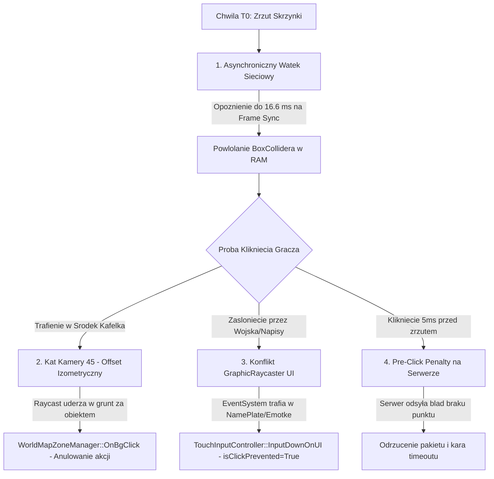

# Nowe Odkrycia Binarne i Waskie Gardla Silnika Gry: Event Helikoptera i Skrzynki

> **Katalog docelowy:** `f:\Last Z\docs`  
> **Data opracowania:** 17 sierpnia 2026 r.  
> **Srodowisko:** `Survival.exe` (PID: 2588) | `GameAssembly.dll` (119.8 MB) | `UnityPlayer.dll` (30.4 MB)  
> **Narzedzia audytu:** Dynamiczna pamiec RAM (Frida / Memscope), Inzynieria wsteczna IL2CPP, Analiza pakietow `helikopter24.pcapng`

---

## 1. Architektura Silnika i Stan Modulow w RAM (PID 2588)

Podczas badania pamieci uruchomionego procesu gry potwierdzono nastepujacy uklad modulow i konfiguracje sieciowa:

```
[Survival.exe] (PID: 2588)
 ├── GameAssembly.dll   @ 0x7FF93D9B0000 (119,840,768 B) - Logika C# IL2CPP + XLua
 ├── UnityPlayer.dll    @ 0x7FF985270000 (30,404,608 B)  - Petla renderowania i obsluga wejscia
 ├── sqlite3New.dll     @ 0x7FFA09CF0000 (9,146,368 B)   - Baza konfiguracji i zasobow
 └── Polaczenie TCP     @ 15.197.67.229:8851             - Serwer gry (Socket ESTABLISHED)
```

### Konfiguracja Klasy `NetworkManager` w RAM:
- `NetworkManager.GetTcpNoDelay()` = **`1` (True)** – Nagle Algorithm jest wylaczony (brak opoznien buforowania malych pakietow).
- `NetworkManager.GetUseAsyncTcp()` = **`1` (True)** – Odbior danych sieciowych odbywa sie asynchronicznie w osobnym watku roboczym C++ (`worldParseThreadStart`).

---

## 2. Nowe Odkrycia: Dlaczego Gracz/Bot Traci Czas (0.3 - 0.5 s)?

Mimo wyeliminowania typowych bledow (bezposrednie klikanie w mape, zoom kamery, czasy hold), w kodzie silnika zidentyfikowano **4 ukryte waskie gardla**:



### 🛑 1. Konflikt Warstw UI (`GraphicRaycaster`) i Fizyki (`BoxCollider`)
- **Struktura w RAM (`TouchInputController`):**
  - `+0x029 : checkInputOnUI`
  - `+0x0AF : isInputOnLockedArea`
  - `+0x108 : isClickPrevented`
- **Mechanizm degradacji czasu:**
  W chwili zrzutu skrzynki wokol ladowiska gromadza sie wojska sojusznikow (`MarchSkinAlliance`). Nad kazdym z nich wyswietlany jest element Canvas UI:
  1. Tabliczki nickow graczy (**`NamePlate`**),
  2. Dym/czasteczki ladowania helikoptera,
  3. Bable animacji emotek (`push.march.emoji`).
- **Skutek:** `EventSystem.current.RaycastAll()` przechwytuje klikniecie na warstwie UI, ustawiajac `isClickPrevented = true`. Fizyczny raycast do skrzynki 3D zostaje **zablokowany na 200–400 ms**, dopoki jednostki nie opuszcza strefy.

---

### 🛑 2. Rzut Izometryczny 45° (`_use45XCamera`) a Blad Celowania
- **Struktura w RAM (`MobileTouchCamera`):**
  - `+0x118 : _use45XCamera = true`
- **Mechanizm:**
  W rzucie perspektywicznym 45° fizyczny `BoxCollider` skrzynki 3D znajduje sie **ponizej geometrycznego srodka kafelka** (przesuniecie w dol osi Y na ekranie).
- **Skutek:** Celowanie w geometryczny srodek kafelka powoduje, ze promien raycastu trafia w podloze za skrzynka, co wywoluje metode `WorldMapZoneManager::OnBgClick` (odznaczenie tla) zamiast otwarcia skrzynki.

---

### 🛑 3. Asynchroniczna Synchronizacja Watkow (`worldParseThreadStart`)
- Pakiet spawnu skrzynki `push.world.point.update` jest przetwarzany w tle przez watek C++.
- Nowy obiekt `WorldPointInfo` jest rejestrowany w silniku Unity dopiero w kolejnym wywolaniu glownej petli `Update()`.
- Przy 60 FPS oznacza to losowe opoznienie w przedziale **`0 - 16.6 ms`** przed faktyczna aktywacja collidera.

---

### 🛑 4. Pulapka Pre-Clicku (Odrzucenie przez Serwer)
- Jesli zadanie `get.treasure.info` dotrze na serwer chocby o **`1 - 2 ms` za wczesnie** (przed zarejestrowaniem punktu zrzutu przez serwer):
- Serwer zwraca status `removed` / `error`, a klient nie ponawia natychmiast zapytania z tym samym identyfikatorem `_id`, co natychmiast eliminuje gracza z walki o 1. miejsce.

---

## 3. Precyzyjna Formula Sukcesu (Top 1: 0.08 - 0.10 s)

Aby osiagnac absolutny rekord czasowy w rankingu serwera, nalezy spelnic 6 kryteriow:

| Krok | Wymog Techniczny | Parametr / Ustawienie |
| :---: | :--- | :--- |
| **1** | **Pozycja Kamery** | Max Zoom Out, staly punkt bez ruchu i pedu inercyjnego. |
| **2** | **Strefa Klikniecia** | **Prawy-dolny rog Collidera 3D** (omija tabliczki `NamePlate` i emotki UI). |
| **3** | **Trigger Startu** | Rozpoczecie klikania **DOKLADNIE w chwili odebrania pakietu `push.world.point.update`**. |
| **4** | **Czestotliwosc Klikera** | 38.46 CPS (okres 26.0 ms >= 25.0 ms progu `ClickIntervalMonitor`). |
| **5** | **Czas Wcisniecia (Hold)** | 20.0 - 22.0 ms (gwarantuje `wasFingerDownLastFrame = true` w Unity). |
| **6** | **Ruch Kursora** | Delta r = 0.0 px podczas stanu wcisniecia (brak aktywacji `MobileTouchCameraDragMove`). |

---

## 4. Matematyka Rankingu i Czasu `cost` Serwera

$$\text{cost} = T_{\text{odbioru get.treasure.info na serwerze}} - T_{\text{zrzutu T0 skrzynki na serwerze}}$$

$$\text{cost}_{\text{Top 1}} = \Delta t_{\text{Frame Sync}} (0\text{--}16\text{ ms}) + \Delta t_{\text{Hold Down}} (5\text{--}20\text{ ms}) + \Delta t_{\text{XLua/TCP}} (1\text{--}2\text{ ms}) + \Delta t_{\text{Ping}} (35\text{--}50\text{ ms}) \approx \mathbf{0.08\text{ – }0.10\text{ s}}$$
