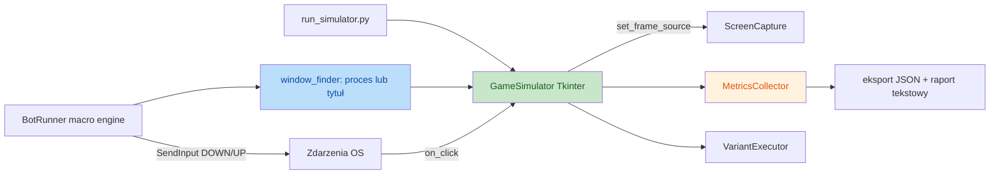

# Game Simulator Testing Framework — Design

Data: 2026-09-02
Status: zaakceptowany do planowania

## Cel

Jeden działający framework, który testuje macro bota helikoptera i mierzy metryki
(celność, opóźnienie, czas detekcji, niezawodność), używając realnych kliknięć OS
w okno symulatora. Zbudowany na istniejącym symulatorze Tkinter jako jedynym
źródle prawdy. Bot pozostaje niezmieniony poza fallbackiem wyszukiwania okna po tytule.

## Zakres

- Symulator wizualny (Tkinter) odtwarza cykl gry: CHAT → ALERT → HELKA (skrzynka) → powrót do CHAT.
- Bot czyta klatki symulatora przez `ScreenCapture.set_frame_source` (zamiast dxcam).
- Bot znajduje „okno gry" po tytule `LastZ Simulator`, gdy proces `Survival.exe` nie istnieje.
- Bot klika przez prawdziwy `SendInput`; symulator weryfikuje kliknięcia względem ROI.
- Metryki: celność (hit/miss), latency, czas detekcji OCR/wizji, niezawodność.
- Warianty testowe z `variants.py` (`default`, `hard_mode`, `stress_test`) zachowane i wbudowane.
- Jeden entry point CLI: `run_simulator.py`.

## Poza zakresem

- Headless `SimulationEngine` i raporty HTML z fazy 3 (odstawione).
- Automatyzacja CI/CD (można dodać później).
- Zmiany w logice macro bota, clickera lub OCR.

## Architektura



### Struktura plików

```
mvp/simulator/
  __init__.py
  game.py        # GameSimulator (Tkinter) — z AdvancedGameSimulator + SimulatorUI
  metrics.py     # MetricsCollector: celność, latency, detekcja, niezawodność
  variants.py    # przeniesiony bez zmian (VARIANT_PRESETS)
  config.py      # przeniesiony bez zmian (BOT_CONFIG_PARAMS itd.)
  bot_bridge.py  # BotBridge: step_callback bota + set_frame_source + tytuł okna

run_simulator.py          # jedyny entry point CLI (root)
```

### Komponenty i odpowiedzialności

1. **GameSimulator** (`game.py`) — rysuje sceny, zna ROI alertu i skrzynki,
   przyjmuje realne kliknięcia (`on_click`), wywołuje `verify_click`, steruje
   pętlą iteracji i deleguje metryki do `MetricsCollector`. Utrzymuje offset crop
   viewport → full image dla poprawnego mapowania kliknięć.

2. **MetricsCollector** (`metrics.py`) — zbiera `click_log` per faza
   (`alert`/`treasure`), liczy agregaty: średnia/percentyle latency, % hit,
   liczba awarii powrotu do chatu. Eksportuje `session_<id>.json` i raport tekstowy.

3. **VariantExecutor** (`variants.py` + `config.py`) — zachowane presety; symulator
   zmienia wizualnie scenę i parametry bota (CPS) na podstawie wariantu.

4. **BotBridge** (`bot_bridge.py`) — podpina `BotRunner.step_callback` (obok
   `MacroStepLogger`) do odczytu timestampu detekcji alertu; ustawia
   `set_frame_source(get_current_frame_raw)`; konfiguruje tytuł okna symulatora.

### Zmiana w bocie

Jedyna zmiana w kodzie produkcyjnym bota: `mvp/bot/window_finder.py` dostaje
fallback — gdy `_find_process_pids(process_name)` jest puste, szuka widocznego
okna o tytule `LastZ Simulator` i zwraca jego `WindowInfo` (geometria z
`GetClientRect` + `ClientToScreen`, tak jak dla realnego okna). `force_foreground`,
`is_foreground` i cała reszta działają bez zmian.

## Pętla gry

```
iteracja:
  1. stan CHAT, klatka bez alertu
  2. trigger_alert() → stan ALERT_ANIMATION; zapis t_alert_show
  3. bot (SCROLL_LISTEN_CHAT) wykrywa alert; step_callback → t_detect
  4. bot klika współrzędne helikoptera (SendInput) → on_click → verify_click (ROI alertu)
  5. stan HELKA (treasure), klatka z timerem
  6. bot (WATCH_TIMER) spamuje w ROI skrzynki → weryfikacja spamu
  7. powrót do CHAT; zapis niezawodności (czy wrócił, bez wyjątków)
```

### Metryki

| Metryka | Definicja | Źródło |
|---------|-----------|--------|
| celność (hit/miss) | klik w ROI alertu / skrzynki | `verify_click` per faza |
| latency | t_pierwszy_klik − t_alert_show | timer symulatora |
| czas detekcji | t_detect − t_alert_show | `step_callback` bota |
| niezawodność | powrót do CHAT, brak wyjątków/zawieszeń | stan symulatora + logi bota |

## Obsługa błędów

- Gdy `find_game_window` nie znajdzie ani procesu, ani okna symulatora: log warning
  i powrót do stanu CHAT bez oznaczania iteracji jako „hit".
- `verify_click` ignoruje kliknięcia poza stanem `alert_animation` (zwraca False),
  aby nie zliczać przypadkowych zdarzeń.
- Eksport metryk nie rzuca wyjątków przy braku kliknięć — zapisuje puste agregaty.

## Testy

- Test `find_game_window` z fallbackiem po tytule (mock `psutil`/`EnumWindows`).
- Test `verify_click` dla poprawnego mapowania cropped → full (offset zerowy i niezerowy).
- Test `MetricsCollector` agregacji latency/hit/niezawodności.
- Test `BotBridge` podpinania `step_callback` bez nadpisywania `MacroStepLogger`.
- Aktualizacja importów w `mvp/tests/game_window/`.

## Kryteria sukcesu

1. `uv run python run_simulator.py` uruchamia symulator, bot i zbiera metryki.
2. Realne kliknięcia OS trafiają w ROI i są poprawnie klasyfikowane jako hit/miss.
3. JSON z metrykami zawiera wszystkie 4 metryki per iteracja.
4. Bot działa bez zmian poza fallbackiem `window_finder.py`.
5. Testy symulatora przechodzą bez regresji.