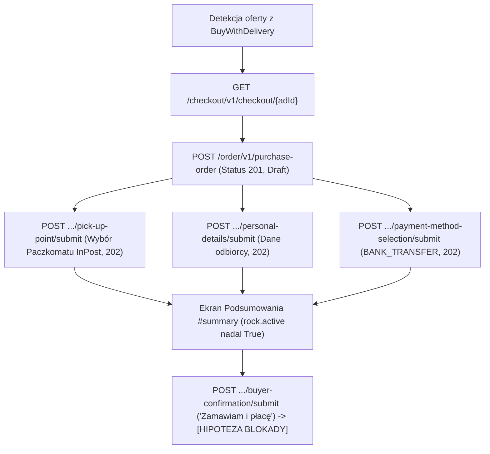

# KOMPENDIUM OLX: Jednolite Źródło Prawdy i Architektura Systemu

> Wersja: 1.2 (2026-09-02)
> Standard: Pesymistyczna inżynieria dowodowa (AGENTS.md)
> Każde twierdzenie w tym dokumencie opiera się na surowych plikach JSON i przechwyconym ruchu sieciowym.
> Jeśli nie ma dowodu w plikach JSON = traktowane jako [HIPOTEZA] lub [OBALONE].

---

## SPIS TREŚCI
1. [Słownik pojęć i identyfikatorów](#1-słownik-pojęć-i-identyfikatorów)
2. [Moduł detekcji: Sekwencyjność i przewaga czasowa](#2-moduł-detekcji-sekwencyjność-i-przewaga-czasowa)
3. [Warstwa sieciowa i zabezpieczenia (CloudFront, DataDome, AWS WAF)](#3-warstwa-sieciowa-i-zabezpieczenia)
4. [Uwierzytelnianie i sesja (AWS Cognito, persistent context, tokeny)](#4-uwierzytelnianie-i-sesja)
5. [Struktura oferty i sygnał dostawy (`delivery.rock`)](#5-struktura-oferty-i-sygnał-dostawy)
6. [Silnik zakupu Pay & Ship (`pl.ps.prd.eu.olx.org`)](#6-silnik-zakupu-pay--ship)
7. [Falsyfikacja i lista obalonych mitów](#7-falsyfikacja-i-lista-obalenych-mitów)
8. [Stan badań: Co wiemy na 100%, a co pozostaje hipotezą](#8-stan-badań)

---

## 1. Słownik pojęć i identyfikatorów

* **`numeric_ad_id`** (np. `1018987579`) — unikalne numeryczne ID ogłoszenia w bazie OLX. Wartości są sekwencyjne.
* **`delivery.rock.offer_id`** (UUID, np. `0a9d7198-9287-4beb-a59a-472691546501`) — identyfikator oferty w mikroserwisie przesyłek Rock. **Nie jest tożsamy z ID ogłoszenia** [UDOWODNIONE].
* **`purchase_order_id`** (UUID, np. `988ace3a-7350-08f7-9c7e-cc9af6b3209d`) — unikalny identyfikator sesji zamówienia zakupu tworzony przez endpoint `POST /order/v1/purchase-order`.
* **`fulfillment_id`** (UUID) — identyfikator kroku logistycznego (wybór metody dostawy i Paczkomatu).
* **`billing_id`** (UUID) — identyfikator danych rozliczeniowych kupującego.
* **`servicePointId`** (np. `inpost:PAR01BAPP`) — unikalny kod punktu odbioru InPost Paczkomat.

---

## 2. Moduł detekcji: Sekwencyjność i przewaga czasowa

* **Zasada działania**: Nowe ogłoszenia na OLX otrzymują kolejne liczbowe ID. Algorytm bota (`bot/detector.py`) prognozuje kolejne ID i odpytuje bezpośrednie endpointy `GET /api/v1/offers/{id}/`.
* **Przewaga nad wyszukiwarką**: **9 do 14 minut** [UDOWODNIONE]. Ogłoszenie pojawia się w API natychmiast po akceptacji, podczas gdy indeks wyszukiwarki i strona kategorii mają opóźnienie propagacji cache.
* **Hole sweeper**: Mechanizm cofający się w oknie ID, aby wyłapywać ogłoszenia, które trafiły na dłuższą moderację i zostały opublikowane z opóźnieniem.

---

## 3. Warstwa sieciowa i zabezpieczenia

1. **CloudFront 403 (TLS Fingerprinting)** [UDOWODNIONE]:
   - Standardowe biblioteki Pythona (`requests`, `urllib`, `aiohttp`) są natychmiast blokowane przez CloudFront z kodem 403.
   - **Rozwiązanie**: Użycie biblioteki `curl_cffi` z parametrem `impersonate="chrome124"`. Pozwala to w 100% obejść blokady TLS na endpointach API.
2. **DataDome & AWS WAF CAPTCHA (Slider Puzzle)** [UDOWODNIONE]:
   - Podczas logowania oraz podejrzanych operacji OLX serwuje wyzwanie układanki (slider).
   - Wymaga to obecności ważnych ciasteczek `aws-waf-token` oraz `datadome`.
   - Rozwiązanie zaadaptowane z bota Vinted: jednorazowe przejście w oknie przeglądarki (`login_headed.py` / `ZALOGUJ_SIE_OLX.bat`) zapisuje te tokeny w profilu `profiles/olx_profile`, dzięki czemu w trybie headless kolejne zapytania nie są blokowane.

---

## 4. Uwierzytelnianie i sesja

1. **Serwer autoryzacyjny**: OLX nie uwierzytelnia na `www.olx.pl`, lecz na serwerze AWS Cognito pod domeną **`login.olx.pl`** (Client ID: `6j7elk01p32o648o1io8lvhhab`).
2. **Krótki czas życia tokena JWT**:
   - `access_token` ma czas życia **dokładnie 15 minut** (`exp - iat = 900 s`) [UDOWODNIONE empirycznie kodem 401 w Raporcie 01].
   - Wniosek: Ręczne kopiowanie tokenów jest bezużyteczne w produkcji.
3. **Cicha reautoryzacja (`silent authentication`)**:
   - Frontend OLX odświeża token w tle przez ukryty iframe:
     `GET https://login.olx.pl/oauth2/authorize?client_id=...&prompt=none&response_mode=web_message`
   - Sukces zależy wyłącznie od ciasteczek sesyjnych serwera `login.olx.pl`.
4. **Architektura Trwałego Profilu (`profiles/olx_profile`)**:
   - Przeglądarka Chromium działa na stałym profilu na dysku (`user_data_dir`).
   - Odświeżanie tokena odbywa się automatycznie w tle (`gemini/skrypty/test_session_refresh.py`).
   - Weryfikacja sesji: `GET https://www.olx.pl/api/v1/users/me/` z Bearer tokenem zwraca `200 OK` i dane konta.

---

## 5. Struktura oferty i sygnał dostawy (`delivery.rock`)

W odpowiedzi endpointu `GET /api/v1/offers/{id}/`:
* Klucz `delivery.rock` decyduje o możliwości zakupu:
  - `active: true` oraz `mode: "BuyWithDelivery"` — oferta kupowalna z Przesyłką OLX [UDOWODNIONE].
  - `mode: "NotEligible"` — brak opcji przesyłki [UDOWODNIONE].
  - `mode: "Ask4Delivery"` — opcja poproszenia sprzedawcy o dodanie przesyłki [UDOWODNIONE].
* `delivery.rock.offer_id` zawiera UUID (np. `0a9d7198-9287-4beb-a59a-472691546501`).

---

## 6. Silnik zakupu Pay & Ship (`pl.ps.prd.eu.olx.org`)

Prawdziwym backendem transakcyjnym OLX jest dedykowany mikroserwis:
**`https://pl.ps.prd.eu.olx.org`** [UDOWODNIONE na ofercie 1018987579].

### Maszyna stanów zamówienia zakupu:

### Przechwycone endpointy API [UDOWODNIONE]:

1. **Pobranie szczegółów i kosztów dostawy**:
   - `GET https://pl.ps.prd.eu.olx.org/checkout/v1/checkout/{adId}`
2. **Inicjalizacja zamówienia (Draft Order)**:
   - `POST https://pl.ps.prd.eu.olx.org/order/v1/purchase-order`
   - Body: `{"adId": 1018987579}` -> Kod `201 Created`, zwraca `id` zamówienia.
   - Potwierdzone czystym API `curl_cffi` (plik `gemini/dane/purchase_order_api_proof.json`).
3. **Zapisanie wybranego punktu InPost**:
   - `POST https://pl.ps.prd.eu.olx.org/fulfillment/v1/fulfillment/{fulfillment_id}/pick-up-point/submit`
   - Body: `{"servicePointId": "inpost:PAR01BAPP"}` -> Kod `202 Accepted`.
4. **Zapisanie danych odbiorcy**:
   - `POST https://pl.ps.prd.eu.olx.org/fulfillment/v1/fulfillment/{fulfillment_id}/personal-details/submit`
   - Body: `{"firstName": "...", "lastName": "...", "email": "...", "phoneNumber": "+48..."}` -> Kod `202 Accepted`.
5. **Wybór metody płatności**:
   - `POST https://pl.ps.prd.eu.olx.org/order/v1/purchase-order/{id}/payment-method-selection/submit`
   - Body: `{"paymentMethod": "BANK_TRANSFER"}` -> Kod `202 Accepted`.
6. **Rezygnacja z faktury i darowizny**:
   - `POST .../invoicing/v1/billing/{id}/billing-needed/submit` -> `{"needed": false}` (202 Accepted).
   - `POST .../donation-selection/submit` -> `{"selection": {"id": "SUPPORT_UKRAINE", "value": {"amount": 0, "currency": "PLN"}}}` (202 Accepted).
7. **Finalne zatwierdzenie zakupu (Zamawiam i płacę)**:
   - `POST .../purchase-order/{id}/buyer-confirmation/submit`

---

## 7. Falsyfikacja i lista obalonych mitów

| Twierdzenie | Prawda inżynierska | Status |
|---|---|---|
| Checkout to `POST /delivery/checkout/{id}/` | Błędny URL. Zwraca 404. Właściwy to mikroserwis `pl.ps.prd.eu.olx.org`. | [OBALONE] |
| Endpointy `/api/v1/delivery/orders/` itp. | Nie istnieją w systemie OLX (404). | [OBALONE] |
| Refresh token leży w `localStorage` / `sessionStorage` | Magazyny nie zawierają tokenów autoryzacyjnych. Sesja trwała siedzi w ciasteczkach `login.olx.pl`. | [OBALONE] |
| Ręczne kopiowanie tokenów pozwala na pracę bota | Token wygasa po 15 min; ręczna obsługa jest technicznie niewykonalna. | [OBALONE] |
| `POST /order/v1/purchase-order` natychmiast blokuje ofertę | **NIEPRAWDA.** Utworzone zamówienie ma status `Draft`, a `delivery.rock.active` nadal wynosi `True`. | [OBALONE] |
| Uzupełnienie danych odbiorcy i Paczkomatu blokuje ofertę | **NIEPRAWDA.** Na ekranie Podsumowania (`#summary`) oferta wciąż ma `delivery.rock.active: true`. | [OBALONE] |

---

## 8. Stan badań: Co wiemy na 100%, a co pozostaje hipotezą

### Udowodnione w 100% [UDOWODNIONE]:
1. Detektor ma 9-14 minut przewagi nad stroną www.
2. `curl_cffi` z `chrome124` omija CloudFront 403.
3. Bearer token z trwałego profilu autoryzuje całe API `pl.ps.prd.eu.olx.org`.
4. Wybór Paczkomatu przez DOM modalu: selektor `button[data-testid='map-list-item']`.
5. Kompletne payloady wszystkich kroków przed podsumowaniem (`pick-up-point`, `personal-details`, `payment-method`, `billing`).
6. Wszystkie te kroki można wykonać sekwencją zapytań HTTP POST (kody 202) w ułamku sekundy, bez konieczności klikania po mapie.
7. Do momentu wejścia na ekran Podsumowania oferta jest nadal aktywna i kupowalna dla każdego.

### Pozostające hipotezą [HIPOTEZA]:
* **Blokada 15 minut**: Hipoteza zakłada, że wywołanie `POST buyer-confirmation/submit` (przycisk „Zamawiam i płacę”) przestawia ofertę w status zablokowany (`delivery.rock.active = false`) i uruchamia 15-minutowy timer rezerwacji w bramce PayU/BLIK. Nie zostało to jeszcze przetestowane, ponieważ wiąże się z realnym zakupem i pobraniem środków (62,48 zł).
