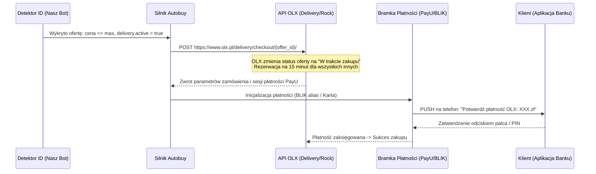

# Recon OLX — Analiza Techniczna Modułu AUTOBUY (Przesyłka OLX) — 2026-09-01

## 1. Pytanie zleceniodawcy (smartcare)
> *„Myślisz, że do ogłoszeń z przesyłką olx można dodać autobuy? Coś takiego na jednym z discordów zobczyłem [FlipAlert].”*

## 2. Podsumowanie inżynierskie (Werdykt)
**TAK, dodanie modułu Autobuy do ogłoszeń z Przesyłką OLX jest w 100% wykonalne technicznie.**
Co więcej, w połączeniu z naszym detektorem ID (który wykrywa oferty 9–14 minut przed publiczną wyszukiwarką), daje to bezwzględną przewagę nad każdym botem opartym na zwykłym scrapowaniu kategorii czy RSS.

---

## 3. Anatomia i Działanie Autobuya na OLX

Proces zakupu w usłudze „Przesyłka OLX” (wewnętrzna nazwa kodowa w API: `rock` / `BuyWithDelivery`) składa się z 4 faz:

### A. Wymóg autoryzacji (Konto kupującego)
1. W przeciwieństwie do monitorowania (które działa anonimowo przez publiczne API), checkout wymaga uwierzytelnienia na koncie OLX.
2. OLX używa uwierzytelniania przez **AWS Cognito** (`login.olx.pl`, Client ID: `6j7elk01p32o648o1io8lvhhab`).
3. Konto kupującego musi mieć uprzednio skonfigurowane:
   - Imię i nazwisko
   - Numer telefonu
   - Adres e-mail
   - Domyślny punkt odbioru (np. Paczkomat InPost ID)

### B. Mechanizm zamrażania oferty na 15 minut (Rezerwacja koszyka)
- Gdy bot wysyła żądanie checkoutu na `https://www.olx.pl/delivery/checkout/{offer_id}/`, OLX tworzy tymczasową transakcję.
- W bazie danych OLX oferta otrzymuje status rezerwacji.
- Dla wszystkich innych użytkowników i konkurencyjnych botów przycisk „Kup z przesyłką” staje się nieaktywny, a próba zakupu zwraca błąd `409 Conflict` (oferta zarezerwowana).
- Czas trwania blokady: dokładnie **15 minut** (czas wyznaczony przez bramkę PayU na opłacenie zamówienia).

### C. Modele finalizacji płatności
1. **BLIK One-Click (Zalecany):**
   - Jednorazowa rejestracja „BLIK bez kodu” (alias BLIK w PayU na koncie OLX).
   - Bot inicjuje płatność, a klient dostaje natychmiast powiadomienie PUSH w aplikacji swojego banku na telefonie (np. mBank, PKO, Santander). Jedno tapnięcie (odcisk palca) i zakup jest sfinalizowany.
2. **Płatność kartą (Token PayU):**
   - Karta zapisana w profilu PayU. Jeśli bank nie wymaga 3D-Secure SMS, pobranie środków następuje maszynowo w ~1 sekundę.
3. **Płatność linkowa (Telegram 1-Click):**
   - Bot zamraża ofertę na 15 minut i natychmiast przesyła unikalny link do płatności na Telegram klienta. Klient ma 15 minut na opłacenie bez ryzyka, że ktoś sprzątnie mu okazję.

### D. Automatyczne sprawdzanie IMEI (Weryfikacja operatorów)
- Bot analizuje pole `description` ogłoszenia pod kątem 15-cyfrowego ciągu znaków (wyrażenie regularne `r'\b\d{15}\b'`).
- W przypadku znalezienia numeru IMEI, skrypt w tle odpytuje formularze operatorów:
  - **Plus**: `https://www.plus.pl/formularze/promocja-smartfon`
  - **Orange**: `https://www.orange.pl/zobacz/weryfikacja-imei`
  - **Play**: `https://www.play.pl/pomoc/sprzet/sprawdz-wlasciciela-urzadzenia`
  - **T-Mobile**: `https://www.t-mobile.pl/c/sprawdz-sprzet`
- Jeśli urządzenie widnieje jako własność operatora (niespłacone raty) $\rightarrow$ bot automatycznie anuluje transakcję.

---

## 4. Analiza Wyścigu Milisekund (Bot vs Bot)

Dlaczego sam alert na Telegram nie wystarcza na najlepsze okazje i dlaczego Autobuy jest kluczowy:
- **Ścieżka manualna (Alert -> Człowiek):** Detekcja ($100\text{ ms}$) + Powiadomienie Telegram ($200\text{ ms}$) + Reakcja człowieka ($3000-5000\text{ ms}$) + Ładowanie strony ($1500\text{ ms}$) = **Łącznie ~5 do 7 sekund**.
- **Ścieżka Autobuy (Maszyna):** Detekcja ($100\text{ ms}$) + Maszynowy `POST /checkout` ($150\text{ ms}$) = **Łącznie ~250 milisekund**.

Każdy konkurencyjny bot z modułem Autobuy wygra z człowiekiem klikającym w telefon o 4–6 sekund. Dlatego moduł maszynowej rezerwacji jest niezbędny w walce o najbardziej zyskowne oferty.

---

## 5. Ryzyka i Zabezpieczenia Inżynierskie

1. **Ochrona przed fałszywymi ofertami (Scam / Puste pudełka):**
   - Wprowadzenie twardych reguł cenowych (np. dolna granica opłacalności — nie kupujemy iPhone'a 15 za 200 zł, bo to w 100% scam).
   - Wymóg minimalnej długości opisu i wieku konta sprzedającego (np. odrzucanie kont założonych dzisiaj bez ocen).
2. **Ochrona konta przed banami (Anty-Spam):**
   - Blokowanie tylko ofert ściśle spełniających kryteria zysku, aby nie generować dziesiątek porzuconych koszyków na godzinę.
